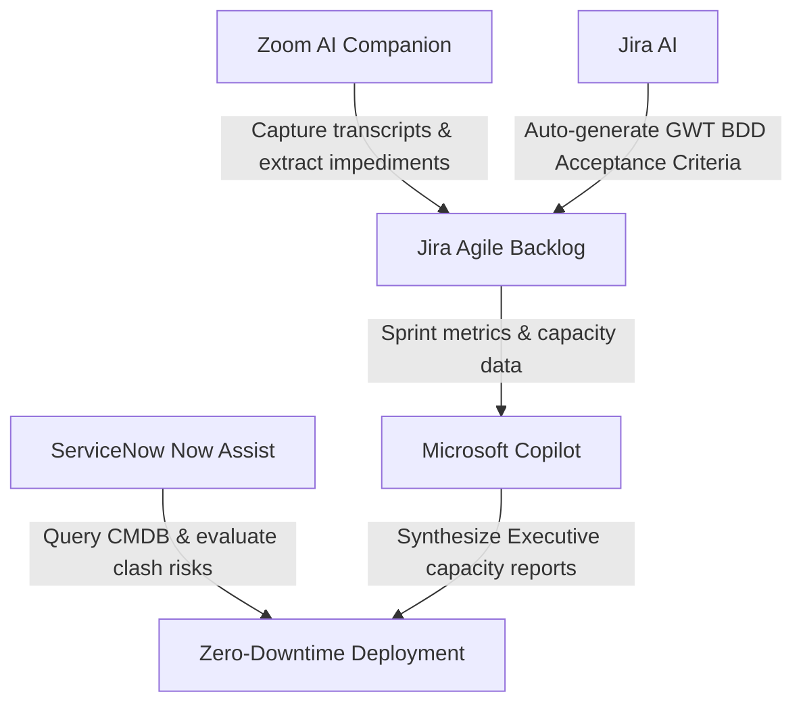

# AI-powered-sdlc-promptbook-
A curated playbook of engineered prompts, workflow automation configurations, and system integration strategies utilizing Jira AI, Copilot, ServiceNow, and Zoom AI to optimize and accelerate the SDLC.

# Generative AI SDLC Automation Playbook 

This repository contains my personal collection of **engineered prompts, scripts, and workflows** designed to integrate generative AI directly into the Software Development Lifecycle (SDLC). 

By automating administrative tasks, metric extraction, and requirement validation across tools like **Jira AI, Microsoft Copilot, ServiceNow Now Assist, and Zoom AI Companion**, I have reduced metric consolidation times and improved overall team velocity.

---

## 🤖 The Tool Integration Architecture



---

## 🎯 High-Performance Prompt Library

### 1. Jira AI: Transforming Roadmaps into BDD User Stories
*   **Goal:** Quickly convert a high-level business requirement into an Agile user story complete with Given-When-Then criteria.
*   **The Prompt:**
    ```text
    Role: Senior Business Analyst and Agile Coach.
    Context: You are writing a user story for our enterprise Life Insurance application.
    Input Requirement: "We need to allow users to update their policy beneficiaries online. The update must be secured with a 2FA OTP sent to their mobile phone."
    
    Task: Write a highly structured Agile User Story in Jira format. 
    Include:
    1. A "User Story" description (As a... I want to... So that...).
    2. A "Business Value" summary.
    3. Clear "Definition of Ready" (DoR) and "Definition of Done" (DoD) criteria.
    4. Two distinct acceptance criteria scenarios written in strict Given-When-Then Gherkin syntax (Scenario 1: Happy path with successful OTP verification; Scenario 2: Failure path with incorrect OTP entry).
    
    Format the output in clean markdown optimized for Jira AI rendering.
    ```

### 2. Microsoft Copilot: Engineering Capacity & Sprint Metric Synthesis
*   **Goal:** Feed raw cycle-time and sprint metrics into Copilot to generate an executive-ready capacity variance report.
*   **The Prompt:**
    ```text
    Role: Senior Technical Delivery Manager.
    Context: You are preparing the end-of-sprint highlight report for senior leadership.
    Raw Data:
    - Target Sprint Velocity: 120 Story Points (SPs).
    - Actual Sprint Velocity: 98 Story Points (SPs).
    - Planned Team Capacity: 8 Resources (320 hours).
    - Actual Team Capacity: 6.5 Resources due to emergency sick leave (260 hours).
    - Unresolved Defect Count: 4 Minor, 0 Major.
    - Delivery Date Variance: 0 days (All scheduled milestones shipped).
    
    Task: Analyze this data using Copilot. Generate a structured 3-paragraph executive summary detailing:
    1. A mathematical evaluation of team velocity efficiency (Story Points completed per available hour).
    2. An assessment of sprint predictability and capacity variance.
    3. Operational recommendations to optimize resource allocation for the next sprint to maintain our 25% velocity improvement trajectory.
    
    Tone: Objective, data-driven, and strategic.
    ```

### 3. ServiceNow Now Assist: Global Deployment Change Assessment
*   **Goal:** Query the virtual assistant to identify database and environment configuration conflicts before a major deployment.
*   **The Prompt:**
    ```text
    Query: "Review change requests scheduled for this Sunday between 01:00 AM and 04:00 AM IST. Cross-reference the database inventories and environment configurations for our 'Insurance Core' and 'Claims Processing' application lines. Flag any active environment overlaps, shared database schema modifications, or deployment stream clashes that could threaten our 18-month zero-downtime milestone. Present the conflicts as a structured table with recommended mitigation strategies."
    ```

---

## 📈 Proven Efficiency Impact
*   **Ceremony Documentation:** Automating Zoom transcript extraction using AI Companions reduced meeting-to-action-item turnaround times by **15%**.
*   **Requirement Ingestion:** Auto-drafting Gherkin criteria with Jira AI cut backlog refinement preparation times for product owners by **3 hours per sprint**.
```
